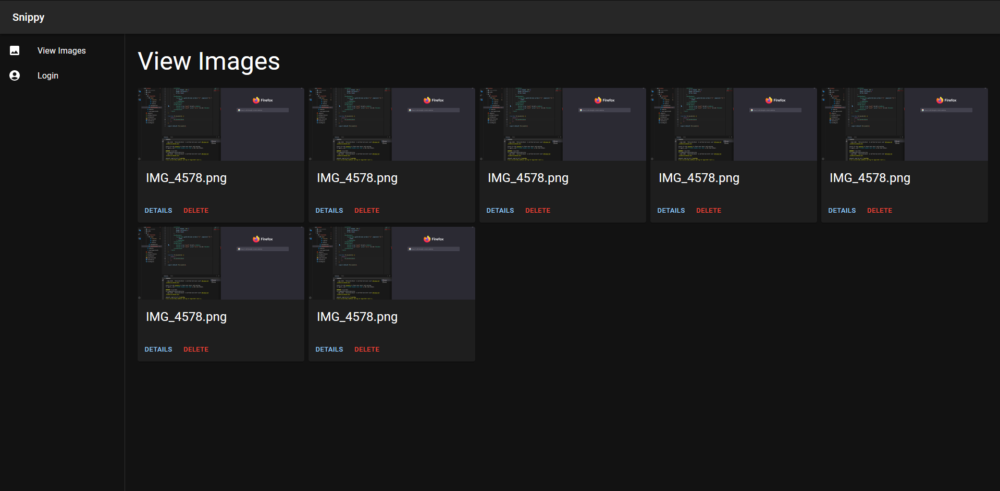

# Snippy

Image uploader (very not finished)



# API Routes

 - POST `/auth/login`
 - GET `/user/me` (Authenticated)
 - POST `/file/upload` (Authenticated)
 - GET `/file/view/:filename`

# Example Sharex Configuration

```json
{
  "Version": "14.1.0",
  "Name": "Snippy",
  "DestinationType": "ImageUploader",
  "RequestMethod": "POST",
  "RequestURL": "http://localhost:3000/file/upload",
  "Headers": {
    "Authorization": "Bearer TOKEN"
  },
  "Body": "MultipartFormData",
  "FileFormName": "files",
  "URL": "{json:files[0].imageUrl}",
  "DeletionURL": "{json:files[0].deleteUrl}"
}
```